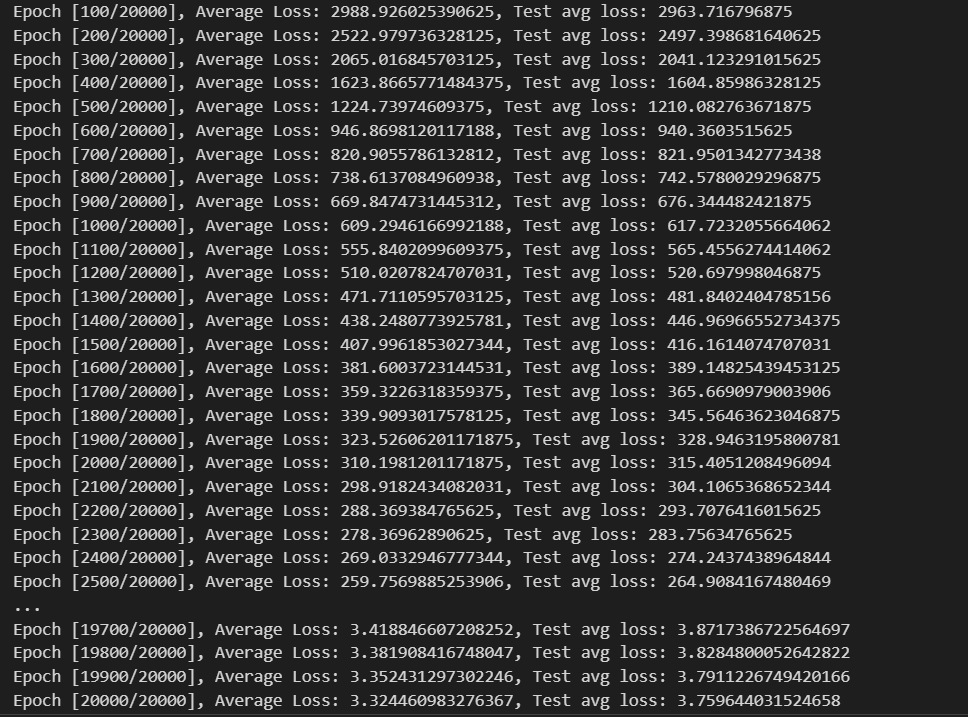

BEST SETTINGS

- This folder tracs the best results to be able to reproduce them

# 1. 2/6/2024

| setting name  |      value       |
| :-----------: | :--------------: |
|    candles    |      80,000      |
|    layers     | 10 relu, 10 relu |
|  manual_seed  |        4         |
|     loss      |      L1Loss      |
|   optimizer   |       Adam       |
| learning rate |      0.0001      |
|    epochs     |      20000       |
|     time      |       51m        |

- good learning curve
- steady gradual decrease = good lr - with more epochs potential to have even lower loss

