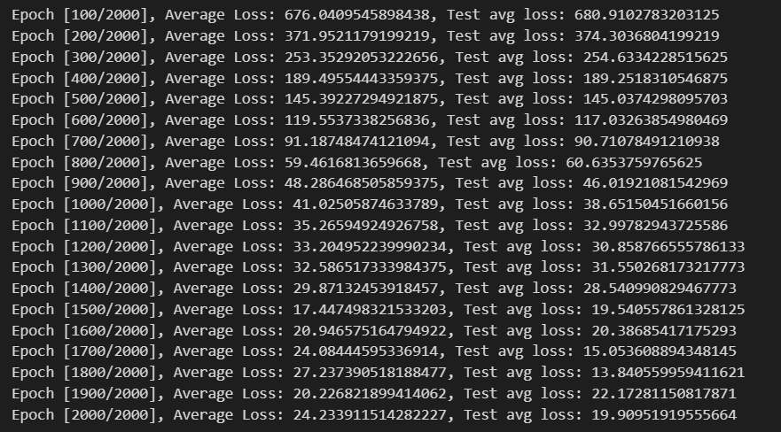
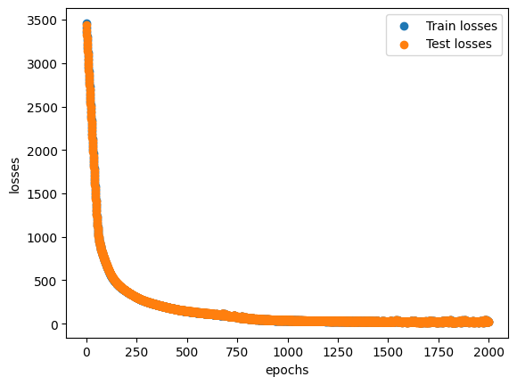
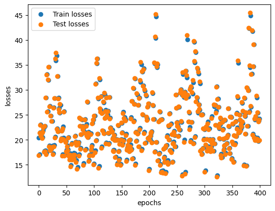

MISTAKES TO AVOID

# 3/6/2024

- graph as a whole is good but at the end the loss starts to jump up and down
- problem could be that optimizer makes too big steps (adjusting weights and biases too much and overshoots correct value) during training - need to decrease learning rate during later epochs

